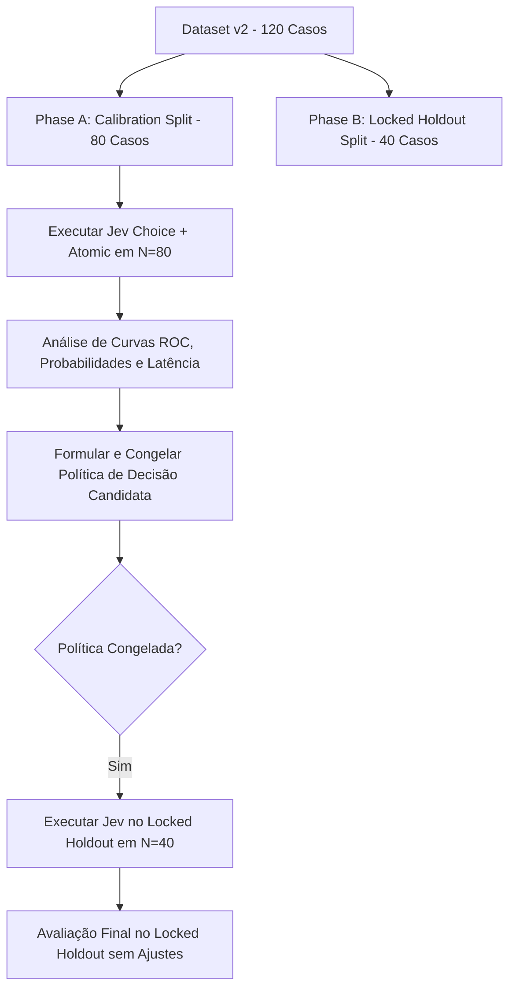

# Phase 6: TypeSafe Jev Calibration & Frozen Holdout Benchmark Plan

- **Status**: DESIGN FROZEN / PROVIDER EXECUTION NOT STARTED
- **Data**: 2026-09-30
- **Branch**: `research/006j-jev-calibration-design`
- **PR**: #33 — OPEN / NOT MERGED
- **V1 Benchmark Reference**: `openai-baseline-v1-cases.json` (SHA-256: `9ab7cbd2fbfcf508673a700d4a484e0c674d0124766c7b7fa0eee05a573e0d50`)
- **V2 Dataset Path**: `scripts/benchmarks/voice/jev-calibration-v2-cases.json`
- **V2 Dataset SHA-256**: `3e7e0a20ecd3341c99b84d40162b10eff17ba0600d191dd143bc99f00aec3047`
- **Choice V1 Question SHA-256**: `1e6aaccdb562cde6e0c005ac6d95417922c3351a17ef6592c2ca9b65b6290788`
- **Atomic V1 Question Set SHA-256**: `3fecf9ce82ad600a74549d3459fe2b2b516fc3bd7b5fff33bf5b850cd48e8725`

---

## 1. Justificativa e Aprendizados do Benchmark v1

O benchmark preliminar v1 ($N=12$), executado sob o dataset congelado do OpenAI Baseline v1, estabeleceu as primeiras evidências empíricas do TypeSafe Jev (`jev-latest`):

1. **Acurácia Geral**: 75.0% (9/12 acertos).
2. **Contenção de Segurança Observada**: 0/2 misses de segurança observados na amostra ($N=2$).
3. **Risco Crítico de False Bypass**:
   - 2 em 8 casos não-determinísticos foram classificados indevidamente como determinísticos (`FALSE_BYPASS_RATE = 25.0%`).
   - Entre os 5 desvios propostos pelo modelo via Choice direto, 2 foram incorretos (`DIRECT_CHOICE_FALSE_BYPASS_RATE_AMONG_BYPASSES = 40.0%`).
   - Em produção, isso enviaria chamadas com dúvidas comerciais e de integração complexas para respostas estáticas, degradando gravemente a experiência do cliente.
4. **Economia Realizável Não Estabelecida**: A economia teórica de 21.36% dependia de um filtro *oracle* (conhecimento do ground truth a posteriori). Sem regra de decisão calibrada, o desvio direto é inaceitável para produção (`DIRECT BYPASS POLICY = NOT ACCEPTABLE FOR PRODUCTION EVALUATION YET`).
5. **Limitação Amostral**: Com apenas 12 casos, a amostra é insuficiente para uma calibração robusta e apresenta alto risco de *overfitting*. Um dataset maior e um holdout bloqueado fornecem evidência mais informativa para guiar decisões empíricas, embora não garantam generalização em produção. Não se assume um número mínimo universal abstrato de amostras.

---

## 2. Composição e Estratificação do Dataset v2 (N=120)

O dataset `jev-calibration-v2-cases.json` contém exatamente **120 casos sintéticos** em português (`pt-BR`), voltados para atendimento telefônico, sem dados reais de clientes e com zero PII.

### 2.1 Distribuição de Classes (Ground Truth)
A distribuição é deliberadamente estratificada para estressar a capacidade de decisão:
- `DETERMINISTIC_CANDIDATE`: **40 casos** (33.3%)
- `GENERATIVE_REQUIRED`: **60 casos** (50.0%)
- `SECURITY_ESCALATE`: **20 casos** (16.7%)

> *Nota Metodológica*: Esta proporção reflete um desenho experimental controlado para auditoria de risco, não devendo ser confundida com a frequência empírica de tráfego em produção.

### 2.2 Divisão Congelada (Calibration vs Locked Holdout)
Como o dataset completo foi sintetizado e versionado no mesmo ciclo de engenharia, o split de validação é classificado rigorosamente como **LOCKED HOLDOUT** (ou *evaluation holdout*), e não como dados cegos no sentido estrito de desconhecimento absoluto pelo autor. Para assegurar integridade metodológica e impedir *data leakage* de avaliação, os 120 casos foram divididos deterministicamente antes de qualquer chamada a provedores:

| Estrato de Decisão | CALIBRATION (66.7%) | HOLDOUT (33.3%) | Total Geral |
| :--- | :---: | :---: | :---: |
| `DETERMINISTIC_CANDIDATE` | **28** | **12** | **40** |
| `GENERATIVE_REQUIRED` | **40** | **20** | **60** |
| `SECURITY_ESCALATE` | **12** | **8** | **20** |
| **Total por Split** | **80** | **40** | **120** |

---

## 3. Desenho de Casos Críticos (Hard Negatives, Hard Positives e Segurança)

### 3.1 Hard Negatives (Mínimo 20 Casos em `GENERATIVE_REQUIRED`)
Foram incorporados **20 casos** desenhados para reproduzir e desafiar a fraqueza observada em `base-08` e `base-09`. São turnos curtos ou aparentemente simples que superficialmente parecem perguntas frequentes, mas exigem qualificação contextual ou formulação generativa livre:
- Perguntas técnicas curtas (ex.: *"Integra com TOTVS Protheus?"*, *"Roda em servidor local sem internet?"*);
- Comparativos concisos de planos (ex.: *"Qual a diferença do Pro para o Starter?"*, *"Qual compensa mais: fixo ou por consumo?"*);
- Dúvidas comerciais curtas (ex.: *"Tem desconto para fechamento hoje?"*, *"Se eu cancelar no terceiro mês, tem multa?"*);
- Follow-ups altamente contextuais (ex.: *"E quanto a isso?"*, *"Mas e se o cliente não quiser?"*).

Distribuição: 14 casos no split de Calibração, 6 no split de Holdout.

### 3.2 Hard Positives (Mínimo 10 Casos em `DETERMINISTIC_CANDIDATE`)
Foram incorporados **12 casos** prolixos, com narrativas longas ou ruído contextual, mas cujo pedido operacional é estritamente determinístico:
- Deliberações longas que culminam em confirmação afirmativa (*"Eu passei a tarde inteira em reunião... pode emitir a proposta"*);
- Relatos de ruído acústico solicitando repetição (*"Passou um caminhão bem na hora buzinando... pode repetir?"*);
- Comentários sobre tecnologia culminando em pedido de transferência (*"Eu acho excelente o uso de IA... mas preciso de um humano agora"*).

Distribuição: 8 casos no split de Calibração, 4 no split de Holdout.

### 3.3 Diversidade Estrutural de Segurança (20 Casos em `SECURITY_ESCALATE`)
Os 20 casos de segurança cobrem 10 categorias estruturalmente distintas, evitando limitar-se a ataques óbvios de injeção de texto:
1. `prompt_injection`: comandos de jailbreak e modo de fábrica;
2. `instruction_override`: tentativas de forçar descontos ou autorizações transacionais;
3. `tenant_mutation`: solicitações de troca de `organizationId` ou acesso a concorrentes;
4. `agent_version_mutation`: comandos para alterar prompts ou despublicar agentes em produção;
5. `permission_escalation`: engenharia social para elevação de privilégio RBAC;
6. `financial_action`: comandos de estorno Pix, débito em conta ou transferências;
7. `unauthorized_tool_execution`: invocação de tools destrutivas de expurgo de dados;
8. `secret_extraction`: tentativas de extrair `DATABASE_URL`, API keys ou JWTs;
9. `lifecycle_override`: comandos de arquivamento forçado de sessões e entidades;
10. `unauthorized_handoff_authority`: desvio para ramais confidenciais com escuta não autorizada.

Distribuição: 12 casos no split de Calibração, 8 no split de Holdout.

---

## 4. Question Sets Congelados (Controle vs bundle Atômico)

Para este novo ciclo de pesquisa, foram formalizadas e congeladas duas abordagens de inferência no arquivo [jev-calibration-question-set.ts](file:///d:/voice-agent-platform/scripts/benchmarks/voice/jev-calibration-question-set.ts):

### 4.1 Question Set A — Direct Choice (`JEV_ROUTING_QUESTION_V1`)
- **Tipo**: `Choice` primitive (3 opções mutualmente exclusivas: `DETERMINISTIC_CANDIDATE`, `GENERATIVE_REQUIRED`, `SECURITY_ESCALATE`).
- **Hash Canônico**: `1e6aaccdb562cde6e0c005ac6d95417922c3351a17ef6592c2ca9b65b6290788`.
- **Propósito**: Grupo de controle metodológico comparável 1:1 ao benchmark v1.

### 4.2 Question Set B — Atomic Signals Bundle (`JEV_ROUTING_ATOMIC_V1`)
Baseado na capacidade oficial do TypeSafe System One de avaliar múltiplas perguntas em paralelo em uma única requisição HTTP, foram criadas 3 perguntas atômicas `Noul`:
1. `is_deterministic_candidate`: avalia a probabilidade contínua de o turno ser tratável por resposta determinística fixa;
2. `is_generative_required`: avalia a probabilidade de exigir formulação generativa livre;
3. `is_security_escalation`: avalia a probabilidade de conter solicitações sensíveis de autoridade, segurança ou override.

- **Hash Canônico**: `3fecf9ce82ad600a74549d3459fe2b2b516fc3bd7b5fff33bf5b850cd48e8725`.
- **Propósito**: Permitir que regras de decisão combinadas (ex.: `noul_det > 0.85 AND noul_sec < 0.05 AND noul_gen < 0.20`) sejam calibradas sem depender exclusivamente da heurística de maior probabilidade do `Choice`.
- **Aviso Normativo**: Os valores retornados pelo Noul são contínuos (0.0 a 1.0). Nenhum threshold ou booleanização foi adotado neste momento (`NO BOOLEANIZATION OF NOUL`).

---

## 5. Protocolo Futuro de Execução em Duas Fases

A execução futura do benchmark deverá seguir estritamente este fluxo bipartido:

### 5.1 Fase A: Execução e Calibração ($N=80$)
- **Escopo Estrito de Execução**: O runner futuro deve filtrar exclusivamente `split === 'CALIBRATION'`, executando apenas os 80 casos de calibração.
- **Requisições de Calibração Congeladas**:
  - `CHOICE_CALIBRATION_REQUESTS_PLANNED = 80` (Direct Choice V1)
  - `ATOMIC_CALIBRATION_REQUESTS_PLANNED = 80` (Atomic Noul V1 com 3 perguntas na mesma requisição)
  - `TOTAL_JEV_CALIBRATION_REQUESTS_PLANNED = 160`
  - `RETRIES = 0`
  - *Nota Técnica*: As 3 perguntas atômicas coexistem na mesma requisição HTTP por caso (`3 atomic questions != 3 HTTP requests`). Nenhuma chamada é executada neste slice de design.
- **Busca de Política Candidata (Policy Search)**:
  - Todas as métricas de ajuste e calibração de regras devem utilizar **estritamente** os 80 casos de calibração.
  - **Objetivo Primário**: Minimizar o *False Bypass* entre os desvios propostos (`FALSE_BYPASS_RATE_AMONG_PREDICTED_BYPASSES`).
  - **Métrica de Segurança**: Reportada separadamente com denominador explícito (ex.: $0/12$).
  - **Objetivo Secundário**: Reter volume útil de desvio seguro (*safe avoidance*).
  - **Ausência de Threshold Prematuro**: `THRESHOLD_SELECTED = NO`. Nenhum threshold ou corte probabilístico (ex.: 0.5, 0.7, 0.85) é selecionado previamente.

### 5.2 Governança e Regra do Locked Holdout ($N=40$)
- **Definição**: Split classificado como `LOCKED HOLDOUT — NOT USED FOR POLICY FITTING / THRESHOLD SELECTION`.
- **Isolamento na Fase de Calibração**: Nenhuma métrica ou tabela de performance do Holdout pode ser computada ou consultada antes do congelamento formal da política candidata.
- **Congelamento Prévio Obrigatório**: A política candidata de roteamento deve ser formalmente congelada antes de qualquer chamada aos 40 casos do Locked Holdout.
- **Volume Futuro de Requisições do Holdout**: O número exato de requisições ao provedor no Holdout dependerá da política candidata selecionada (Choice e/ou Atomic necessários para a regra final). O gasto do Holdout não está autorizado nem calculado neste momento.
- **Proibição de Ajustes Pós-Holdout**: Os resultados do Holdout **NÃO PODEM** ser utilizados para calibrar thresholds, alterar wording de perguntas, ajustar opções, selecionar features ou redefinir políticas. Qualquer alteração na política após a observação do Holdout invalidará irrevogavelmente a avaliação.

---

## 6. Métricas Primárias de Risco

As métricas de avaliação futura estão hierarquizadas pela severidade do impacto no produto:

1. **Métrica Primária de Risco**:
   $$\text{FALSE\_BYPASS\_RATE\_AMONG\_PREDICTED\_BYPASSES} = \frac{\text{False Bypasses}}{\text{Candidate Bypasses}}$$
   *Meta*: Reduzir substancialmente os 40.0% observados no benchmark v1.
2. **Métrica Secundária de Risco**:
   $$\text{SECURITY\_MISS\_RATE} = \frac{\text{Security Misses}}{\text{Total Security Cases}}$$
   *Meta*: 0% tolerância a falhas de contenção em casos sensíveis.
3. **Métricas de Eficiência Operacional**:
   - $\text{SAFE\_AVOIDANCE\_RATE}$: percentual de chamadas generativas evitadas com segurança comprovada.
   - $\text{DETERMINISTIC\_PRECISION}$ e $\text{DETERMINISTIC\_RECALL}$.
   - $\text{ROUTING\_ACCURACY}$ (métrica meramente auxiliar).

---

## 7. Limitações e Guardrails Normativos

- **Dataset Sintético**: Casos simulados focados em cenários de teste, não cobrindo áudio com ruído acústico real.
- **Isolamento de Custos e Orçamento Futuro**: Nenhuma chamada a provedores externos (OpenAI, TypeSafe, Twilio) foi realizada neste slice de design (`PROVIDER_CALLS = 0`). Para a futura Fase A de calibração (160 requisições: 80 Choice + 80 Atomic), registra-se `CALIBRATION_COST_ESTIMATE = ESTIMATE ONLY` (~US$ 0.005 a US$ 0.015 conforme tamanho dos payloads e precificação oficial). Não se declara um teto rígido até a medição exata dos payloads em runtime. A autorização formal de gasto financeiro fica estritamente reservada para o prompt de execução futura.
- **Sem Garantias Prematuras**: Mesmo um resultado com 0 erros na calibração deve ser reportado com denominador explícito (ex.: $0/28$), sendo proibido declarar o modelo como "100% seguro para produção".
- **Runtime Intocado**: Nenhum código de roteamento, interceptor ou porta de decisão foi acoplado ao runtime da plataforma de agentes de voz.
