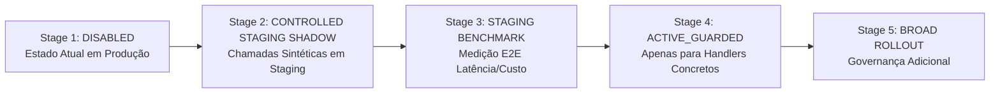

# Phase 6: Jev Guarded Runtime Integration Architecture Design

- **Status**: ACCEPTED DESIGN / NO PRODUCTION EXECUTION
- **Data**: 2026-09-30
- **Branch**: `research/006n-jev-runtime-integration-design`
- **Contexto**: Conclusão da pesquisa sintética preliminar do Jev (Fase A, Fitting Offline, Frozen Candidate Policy e Locked Holdout Evaluation) e aprovação da direção arquitetural pelo operador.
- **Evidência Base (Synthetic Design Input)**:
  - **Calibração (N=80)**: 26/28 safe bypasses, 0/52 false bypasses, 0/12 security misses, 32.50% safe bypass rate.
  - **Locked Holdout (N=40)**: 8/12 safe bypasses, 0/28 false bypasses, 0/8 security misses, 20.00% safe bypass rate no LOCKED HOLDOUT — NOT USED FOR POLICY FITTING / THRESHOLD SELECTION.
  - **Latência Observada Jev Holdout (Design Input)**: Mínima 225ms, Mediana 255ms, P95 descritivo 387ms, Máxima 446ms.
  - **Baseline Histórico OpenAI (Sintético)**: TTFT mediana aproximadamente 1771ms.
  - **Qualificações**: Experimentos sintéticos distintos; não representam latência E2E telefônica, não constituem SLA de produção e não são prova de produção diretamente aditiva.
  - **Frozen Policy**: `T_SECURITY = 0.56`, `T_DETERMINISTIC = 0.35`, `T_GENERATIVE = 0.47`.
  - **Frozen Policy SHA-256**: `1ac0f2919ca73d22a39fb1d964b558ba2f7e395f336b2c3f687ced9ed4d53c93`.
  - **Holdout Status**: `CONSUMED` (imutável, não reutilizável).
  - **Jev Production Integration**: `NO`.
  - **Jev Production Ready**: `NO`.

---

## 1. Pergunta Arquitetural Central e Prontidão de Handlers

### 1.1 O que o runtime pode fazer quando o Jev retorna `DETERMINISTIC_CANDIDATE`?
O TypeSafe Jev é um classificador probabilístico de Sistema 1: **ele NÃO gera o texto conversacional final e NÃO decide ações de negócio**.

Quando o Jev classifica um turno como `DETERMINISTIC_CANDIDATE`, ele apenas emite um sinal consultivo indicando que a fala do interlocutor aparenta não demandar raciocínio generativo aberto nem contém risco de segurança detectado. Para que um bypass determinístico efetivamente ocorra, o runtime da aplicação precisa possuir um manipulador determinístico concreto para onde direcionar o turno.

### 1.2 Auditoria Factual de Handlers Determinísticos no Código Versionado
Uma auditoria no código versionado (`apps/voice/src/`, `packages/contracts/src/voice/`) confirmou:

| Componente Determinístico | Existência no Repositório | Módulo / Arquivo | Observações |
| :--- | :---: | :---: | :--- |
| **Catálogo de Respostas Determinísticas** | `NÃO EXISTE` | - | Não há tabela, JSON ou dicionário de respostas estáticas/pré-gravadas. |
| **Handler de Turno Determinístico** | `NÃO EXISTE` | - | Não há handler para responder a turnos sem passar pelo LLM. |
| **Resposta Fixa Dirigida por Estado** | `NÃO EXISTE` | - | A máquina de estados (`CallSession`) gerencia estados da chamada, mas não gera respostas textuais fixas. |
| **Deterministic Acknowledgment** | `NÃO EXISTE` | - | Não há gerador determinístico de confirmação ("entendido", etc.). |
| **Repeat Handler** | `NÃO EXISTE` | - | Não há lógica determinística para repetir fala anterior. |
| **Transfer Acknowledgment** | `NÃO EXISTE` | - | Não há mensagens determinísticas intermediárias codificadas. |
| **Confirmation Handler** | `NÃO EXISTE` | - | Confirmações são processadas pelo modelo generativo com contexto completo. |
| **Caminho Independente de Ferramentas** | `NÃO EXISTE` | - | Todo turno `user.speech.final` é entregue ao `AssistantStreamCoordinator.streamTurn`, que aciona o `ConversationModelPort.streamTurn` (OpenAI). |

**Total de Handlers Determinísticos Existentes**: `0`.

### 1.3 Classificação de Prontidão
**`ACTIVE_DETERMINISTIC_BYPASS_READINESS = BLOCKED`**

> **Invariante Formal de Runtime**:
> `NO_KNOWN_DETERMINISTIC_HANDLER -> NO_DETERMINISTIC_BYPASS`
> 
> Sem um handler determinístico conhecido e pré-definido pela aplicação, **o bypass determinístico ativo é categoricamente impossível e bloqueado**, independentemente da precisão ou score do Jev. É proibido inventar respostas ad-hoc para forçar um bypass.

---

## 2. Fronteira Rígida de Autoridade e Requisito de Contexto

### 2.1 Limites de Autoridade (Hard Authority Boundary)
O Jev é estritamente um sinalizador probabilístico consultivo. Ele **NUNCA** pode diretamente:
1. Mutar `organizationId` ou dados de tenant;
2. Modificar a versão do agente ou o snapshot de configuração (`AgentConfigurationSnapshotV1`);
3. Alterar permissões, papéis ou autenticação da sessão;
4. Executar ações financeiras, estornos, faturamentos ou descontos;
5. Executar qualquer ferramenta (`tool`), ler ou gravar dados no banco de dados;
6. Modificar o ciclo de vida da chamada telefônica (`CallSession.runtimeState`);
7. Autorizar handoff para atendente humano ou desconectar a IA;
8. Alterar estado de campanhas ou métricas comerciais de faturamento;
9. Escrever qualquer estado durável no banco de dados.

O Jev pode somente retornar: **sinais atômicos tipados e consultivos**.
A máquina de estados determinística da aplicação (`CallSession`) e o banco de dados durável permanecem como a **única fonte da verdade e autoridade de negócio**.

### 2.2 Requisito Arquitetural de Contexto de Provedor
A integração **NÃO DEVE** depender de estado conversacional persistente mantido pelo provedor externo (*The integration MUST NOT rely on provider-side persistent conversation state*). Toda avaliação recebe exclusivamente o estado fornecido de forma explícita pela aplicação no momento da chamada.

---

## 3. Portão de Dados do Cliente e Privacidade (Customer Privacy Gate)

**`CUSTOMER_TRANSCRIPT_PROVIDER_PROCESSING_GATE = NOT CLEARED`**

A porta proposta de avaliação requer a passagem da transcrição do interlocutor (`callerTranscript`). Isso significa que a execução de um classificador externo envolve a transmissão de conteúdo de áudio transcrito para terceiros.

Antes de qualquer uso de tráfego real de clientes, este portão exige aprovação formal prévia abrangendo:
1. Minimização de dados enviados;
2. Termos de processamento e retenção de dados do fornecedor (*provider data-processing terms*);
3. Configuração de consentimento por tenant (`organizationId`);
4. Requisitos legais/regulatórios aplicáveis;
5. Política estrita de log de transcrições.

---

## 4. Análise Factual de Topologias Arquiteturais

```mermaid
flowchart TD
    subgraph Option_A [Opção A: Always-On Serial Gate]
        A1[Caller Turn] --> A2[Jev Classification]
        A2 -->|Deterministic Match| A3[Deterministic Handler]
        A2 -->|Generative Required| A4[OpenAI Streaming]
    end

    subgraph Option_B [Opção B: Parallel Speculative Execution]
        B1[Caller Turn] --> B2[Jev Request]
        B1 --> B3[OpenAI Stream Start]
        B2 -->|Deterministic Wins| B4[Cancel OpenAI Stream]
    end

    subgraph Option_C [Opção C: Application-Eligibility Filtered Serial Gate]
        C1[Caller Turn] --> C2{App State has Known Deterministic Handler?}
        C2 -->|No| C3[OpenAI Direct Path]
        C2 -->|Yes| C4[Jev Validation Request]
        C4 -->|Safe Deterministic| C5[Known Deterministic Handler]
        C4 -->|Generative Required| C3
    end

    subgraph Option_D [Opção D: Controlled Staging Shadow-Only]
        D1[Caller Turn] --> D2[OpenAI Authoritative Streaming]
        D1 -.->|Async Non-Blocking| D3[Jev Advisory Evaluation & Telemetry Log]
    end
```



### 4.1 Classificação Normativa das Opções

| Topologia | Avaliação Arquitetural | Status de Seleção |
| :--- | :--- | :---: |
| **Opção A: Always-On Serial** | Adicionaria ~255ms (mediana sintética) antes do início da OpenAI em 80% dos turnos não-bypassed. | **`NOT SELECTED under current latency evidence`** |
| **Opção B: Parallel Speculative** | Inicia OpenAI de imediato, mas com alto risco de não economizar custos (tokens já gerados/faturados antes do abort) e risco de truncamento audível de fala no cliente. | **`NOT SELECTED due cancellation/cost/streaming complexity`** |
| **Opção C: Eligibility-Filtered Serial** | Aplicação determina a priori se o estado corrente possui handler determinístico conhecido; Jev atua apenas validando se o turno é seguro. | **`SELECTED FUTURE ACTIVE TOPOLOGY, conditional on known deterministic handlers and new evidence`** |
| **Opção D: Shadow-Only** | Avaliação consultiva desacoplada da decisão principal em chamadas sintéticas/controladas de Staging. | **`SELECTED FIRST INTEGRATION TOPOLOGY, initially in controlled staging shadow`** |

---

## 5. Semântica de Execução em Modo Shadow (Bounded Shadow)

O modo SHADOW **não bloqueia nem altera intencionalmente o caminho conversacional autoritativo por design** (*does not intentionally block or alter the authoritative conversation path by design*).

Contudo, a execução em Shadow consome recursos de CPU, memória, capacidade de rede, quota de provedor e orçamento monetário. Ele pode afetar indiretamente a contenção de recursos do sistema a menos que concorrência e contrapressão sejam delimitadas.

### 5.1 Requisitos de Design para o Shadow:
1. **Não-bloqueante**: A resposta autoritativa da OpenAI prossegue sem aguardar o retorno do Jev;
2. **Concorrência Delimitada**: Concorrência máxima controlada (`SHADOW_MAX_CONCURRENCY = NOT SELECTED`);
3. **Fila/Backlog Delimitada**: Fila de espera limitada (`SHADOW_MAX_BACKLOG = NOT SELECTED`);
4. **Cancelável**: Requisições de shadow podem ser abortadas quando a chamada termina;
5. **Descarte Seguro**: Sob pressão de recursos ou timeout, tarefas de shadow são descartadas sem impacto;
6. **Pools de Conexão Protegidos**: Incapaz de gerar promises pendentes ilimitadas ou exaurir pools de conexões HTTP.

---

## 6. Semântica de Falhas e Model Drift

### 6.1 Semântica de Falhas
- **Em SHADOW**:
  - Falha ou timeout do Jev **NÃO provoca fallback de roteamento**, pois o Jev não possui autoridade.
  - O caminho autoritativo da OpenAI prossegue de forma independente.
  - A falha do Jev afeta unicamente a completude da telemetria de auditoria em shadow.
- **Em ACTIVE_GUARDED (Futuro)**:
  - **`FAIL-OPEN TO MAIN MODEL`**: Em caso de timeout, falha de rede, erro de schema, circuito aberto ou model drift, o turno segue imediatamente para o modelo conversacional principal (OpenAI). A chamada nunca é interrompida por falha do Jev.
  - **`FAIL-CLOSED WITH RESPECT TO DETERMINISTIC BYPASS`**: Qualquer falha ou ambiguidade proíbe categoricamente o bypass determinístico.

### 6.2 Comportamento diante de Model Drift
- **Em SHADOW**:
  - Se `providerModel` divergir do modelo formalmente homologado, registra-se a ocorrência na telemetria estruturada e marca-se a avaliação como incompatível/inutilizável para comparação, sem alterar o comportamento da conversa.
- **Em ACTIVE_GUARDED**:
  - Modelo inesperado proíbe expressamente o bypass determinístico e força a rota nominal do modelo principal (`FAIL-OPEN`).

---

## 7. Porta Mínima (YAGNI Analysis)

### 7.1 Status da Porta
- **DESIGN STATUS**: `ACCEPTED`
- **IMPLEMENTATION STATUS**: `PROVIDER-NEUTRAL PORT IMPLEMENTED IN PR #39` (`packages/contracts/src/voice/auxiliary-turn-decision-contracts.ts` e `apps/voice/src/auxiliary-turn-shadow-observer.ts`)
- **CONCRETE TYPESAFE ADAPTER**: `IMPLEMENTED OFFLINE` (`packages/integrations/src/typesafe/typesafe-jev-turn-decision-adapter.ts`)
- **SHADOW PROVIDER WIRING**: `NOT IMPLEMENTED`
- **STAGING EXECUTION**: `NOT EXECUTED`

### 7.2 Semântica da Interface Proposta

```typescript
export interface TurnDecisionEvaluationInput {
  readonly organizationId: string;
  readonly callId: string;
  readonly turnId: string;
  readonly callerTranscript: string;
  readonly channel?: 'phone' | undefined;
  readonly language?: 'pt-BR' | undefined;
}

export interface TurnDecisionEvaluationOutput {
  readonly deterministicScore: number;
  readonly generativeScore: number;
  readonly securityScore: number;
  readonly providerModel: string;
  readonly latencyMs: number;
}

export interface AuxiliaryTurnDecisionPort {
  readonly providerName: string;
  evaluateTurn(
    input: TurnDecisionEvaluationInput,
    signal?: AbortSignal
  ): Promise<TurnDecisionEvaluationOutput>;
}
```

- A porta não retorna comandos de ação (`executeTool`, `responseText`, `handoff`).
- **Separação de Responsabilidades**:
  - **Provider Adapter** (`packages/integrations`): Mapeia requisição HTTP e retorna scores brutos tipados e latência/modelo.
  - **Application Policy Evaluator** (`apps/voice/src/domain/policy`): Aplica a política congelada (`T_SECURITY`, `T_DETERMINISTIC`, `T_GENERATIVE`) e ordenação de regras.
  - **Conversation Orchestrator** (`apps/voice/src/orchestrator`): Detém autoridade exclusiva de roteamento com base no estado e existência de handlers concretos.

---

## 8. Circuit Breaker e Parâmetros Operacionais

### 8.1 Circuit Breaker
- Estados: `CLOSED`, `OPEN`, `HALF_OPEN`.
- Com circuito `OPEN`: suprime chamadas ao Jev; o modelo principal da OpenAI permanece autoritativo.
- Normative invariant: **the auxiliary path MUST NOT block or terminate the authoritative conversation path**.

### 8.2 Parâmetros Postergados para Medição Empírica em Staging
Para evitar ancoragem em limiares não derivados de dados de tráfego real, os seguintes parâmetros ficam registrados como:
- **`CIRCUIT_BREAKER_TRIGGER_THRESHOLDS = NOT SELECTED`**
- **`JEV_TIMEOUT_MS = NOT SELECTED`**
- **`JEV_ACCEPTABLE_TIMEOUT_RATE = NOT SELECTED`**
- **`CONVERSATIONAL_LATENCY_BUDGET_MS = NOT SELECTED`**
- **`SHADOW_MAX_CONCURRENCY = NOT SELECTED`**
- **`SHADOW_MAX_BACKLOG = NOT SELECTED`**

---

## 9. Modelo de Estados de Feature e Teto Global

### 9.1 Teto Global de Funcionalidade (Global Feature Ceiling)
- `GLOBAL_ALLOWED_MODE` atua como um teto rígido e kill switch global do sistema:
  - Global `DISABLED`: Nenhuma organização pode ativar `SHADOW` nem `ACTIVE_GUARDED`.
  - Global `SHADOW`: Organizações podem selecionar `DISABLED` ou `SHADOW`, nunca `ACTIVE_GUARDED`.
  - `ACTIVE_GUARDED`: Requer autorização explícita tanto no teto global quanto na configuração da organização.

### 9.2 Estados de Feature
1. `DISABLED` (Padrão Global Absoluto)
2. `SHADOW` (Primeira etapa em Staging)
3. `ACTIVE_GUARDED` (Bloqueado no momento)

---

## 10. Observabilidade e Proteção de Transcrições

1. **Eventos Estruturados Mínimos**:
   `jev.decision.started`, `jev.decision.completed`, `jev.decision.timeout`, `jev.decision.failed`, `jev.decision.bypassed_by_circuit`, `jev.shadow.comparison`.
2. **Campos Permitidos**:
   `requestId`, `callId`, `organizationId`, `turnId`, `mode`, `latencyMs`, `resolvedModel`, `scores`, `policyDecision`, `circuitState`.
3. **Proteção Rígida de Dados e PII**:
   - A telemetria operacional de rotina **NUNCA DEVE registrar transcrições brutas (`callerTranscript`) nos logs estruturados**.
   - Proibido registrar chaves de API, tokens de autenticação ou segredos.

---

## 11. Semântica do Sinal de Segurança (`SECURITY_ESCALATE`)

O sinal `SECURITY_ESCALATE` significa:
- *"Proibido realizar bypass determinístico; encaminhar obrigatoriamente para avaliação do modelo principal ou regras de segurança da aplicação."*
- **NÃO** significa autorização autônoma para:
  - Executar operações de privilégio;
  - Bloquear o usuário automaticamente;
  - Desligar a chamada automaticamente;
  - Handoff humano automático.

---

## 12. Estágios de Rollout Arquitetural (Staging-First)



1. **Stage 1 — DISABLED (Estado Vigente)**: Jev inativo no código de produção (`JEV_PRODUCTION_INTEGRATION = NO`).
2. **Stage 2 — CONTROLLED STAGING SHADOW**: Próximo slice arquitetural em chamadas controladas de Staging, sem tráfego de clientes (`CUSTOMER_TRANSCRIPT_PROVIDER_PROCESSING_GATE = NOT CLEARED`).
3. **Stage 3 — Staging Latency & Cost Benchmark**: Medição factual de latência e consumo sob autorização formal de custos.
4. **Stage 4 — ACTIVE_GUARDED**: Ativação seletiva sob Topologia C exclusivamente após implementação de handlers determinísticos.
5. **Stage 5 — Broad Rollout**: Expansão sujeita a nova rodada formal de governança.
