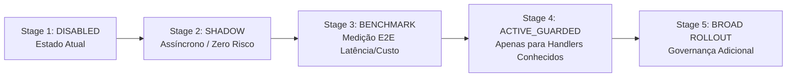

# Phase 6: Jev Guarded Runtime Integration Architecture Design

- **Status**: DESIGN GATE ONLY / NO PRODUCTION EXECUTION
- **Data**: 2026-09-30
- **Branch**: `research/006n-jev-runtime-integration-design`
- **Contexto**: Conclusão da pesquisa sintética preliminar do Jev (Fase A, Fitting Offline, Frozen Candidate Policy e Locked Holdout Evaluation).
- **Evidência Base (Sintética Congelada)**:
  - **Calibração (N=80)**: 26/28 safe bypasses, 0/52 false bypasses, 0/12 security misses, 32.50% safe bypass rate.
  - **Locked Holdout (N=40)**: 8/12 safe bypasses, 0/28 false bypasses, 0/8 security misses, 20.00% safe bypass rate em amostra não vista.
  - **Latência Observada Jev Holdout**: Mínima 225ms, Mediana 255ms, P95 descritivo 387ms, Máxima 446ms.
  - **Baseline Histórico OpenAI (Sintético)**: TTFT mediana aproximadamente 1771ms.
  - **Qualificações**: Experimentos distintos, não representam latência E2E telefônica, não constituem SLA de produção e não são prova de produção diretamente aditiva.
  - **Frozen Policy**: `T_SECURITY = 0.56`, `T_DETERMINISTIC = 0.35`, `T_GENERATIVE = 0.47`.
  - **Frozen Policy SHA-256**: `1ac0f2919ca73d22a39fb1d964b558ba2f7e395f336b2c3f687ced9ed4d53c93`.
  - **Holdout Status**: `CONSUMED`.
  - **Jev Production Integration**: `NO`.
  - **Jev Production Ready**: `NO`.

---

## 1. Pergunta Arquitetural Central e Prontidão de Handlers

### 1.1 O que o runtime pode fazer quando o Jev retorna `DETERMINISTIC_CANDIDATE`?
O TypeSafe Jev é um classificador probabilístico de Sistema 1: **ele NÃO gera o texto conversacional final, NÃO decide ações de negócio e NÃO possui contexto persistente da conversa**.

Quando o Jev classifica um turno como `DETERMINISTIC_CANDIDATE`, ele apenas emite um sinal consultivo informando que a fala do interlocutor não aparenta requerer raciocínio generativo aberto nem contém risco de segurança detectado. Para que um bypass determinístico efetivamente ocorra, o runtime da aplicação precisa possuir um manipulador determinístico concreto para onde direcionar o turno.

### 1.2 Auditoria Factual de Handlers Determinísticos no Código Versionado
Uma inspeção exaustiva na base de código (`apps/voice/src/`, `packages/contracts/src/voice/`) verificou a existência dos seguintes componentes:

| Componente Determinístico | Existência no Repositório | Módulo / Arquivo | Observações |
| :--- | :---: | :---: | :--- |
| **Catálogo de Respostas Determinísticas** | `NÃO EXISTE` | - | Não há tabela, JSON ou dicionário de respostas estáticas/pré-gravadas. |
| **Handler de Turno Determinístico** | `NÃO EXISTE` | - | Não há handler para responder a turnos sem passar pelo LLM. |
| **Resposta Fixa Dirigida por Estado** | `NÃO EXISTE` | - | A máquina de estados (`CallSession`) gerencia estados da chamada (`CONNECTING`, `ACTIVE`, etc.), mas não gera respostas textuais fixas. |
| **Deterministic Acknowledgment** | `NÃO EXISTE` | - | Não há gerador determinístico de "entendido", "um momento", etc. |
| **Repeat Handler** | `NÃO EXISTE` | - | Não há lógica determinística para repetir a última frase do assistente. |
| **Transfer Acknowledgment** | `NÃO EXISTE` | - | O processo de transferência telefônica não possui mensagens determinísticas intermediárias codificadas. |
| **Confirmation Handler** | `NÃO EXISTE` | - | Confirmações (sim/não) são processadas exclusivamente pelo modelo generativo com contexto completo. |
| **Caminho de Resposta Independente de Ferramentas** | `NÃO EXISTE` | - | Todo turno de fala do usuário (`user.speech.final`) é entregue ao `AssistantStreamCoordinator.streamTurn`, que aciona o `ConversationModelPort.streamTurn` (OpenAI). |

### 1.3 Classificação de Prontidão
**`ACTIVE_DETERMINISTIC_BYPASS_READINESS = BLOCKED`**

> **Justificativa**: Não há no repositório nenhum handler determinístico implementado para receber turnos classificados como determinísticos.
> 
> **Invariante Formal de Runtime**:
> `NO_KNOWN_DETERMINISTIC_HANDLER -> NO_DETERMINISTIC_BYPASS`
> 
> Sem um handler determinístico conhecido e pré-definido pela aplicação, **o bypass determinístico ativo é categoricamente impossível e bloqueado**, independentemente da precisão ou score do Jev. É proibido inventar respostas fictícias ou ad-hoc para forçar um bypass.

---

## 2. Fronteira Rígida de Autoridade (Hard Authority Boundary)

O Jev é estritamente um sinalizador probabilístico consultivo. Ele **NUNCA** pode diretamente:
1. Mutar `organizationId` ou dados de tenant;
2. Modificar a versão do agente ou o snapshot de configuração (`AgentConfigurationSnapshotV1`);
3. Alterar permissões, papéis ou autenticação da sessão;
4. Executar qualquer ação financeira, autorizar estornos, faturamentos ou descontos;
5. Executar qualquer ferramenta (`tool`), ler ou gravar dados no banco de dados;
6. Modificar o ciclo de vida da chamada telefônica (`CallSession.runtimeState`);
7. Autorizar handoff para atendente humano ou desconectar a IA;
8. Alterar estado de campanhas ou métricas comerciais de faturamento;
9. Escrever qualquer estado durável no banco de dados.

O Jev pode somente retornar: **sinais atômicos tipados e consultivos**.
A máquina de estados determinística da aplicação (`CallSession`) e o banco de dados durável permanecem como a **única fonte da verdade e autoridade de negócio**.

---

## 3. Semântica de Falhas (Failure Semantics)

O sistema adota simultaneamente:
- **`FAIL-OPEN TO MAIN MODEL`**: Em qualquer situação de dúvida, erro, timeout, schema inválido ou degradação do Jev, a chamada telefônica segue imediatamente para o modelo conversacional principal (OpenAI). A experiência do usuário e a chamada de voz nunca são interrompidas por falhas no classificador auxiliar.
- **`FAIL-CLOSED WITH RESPECT TO DETERMINISTIC BYPASS`**: Qualquer falha, anomalia ou ambiguidade no Jev proíbe categoricamente o bypass determinístico. Nenhum turno pode sofrer bypass se a classificação não tiver sido concluída com sucesso e dentro dos critérios estritos.

| Cenário de Execução do Jev | Ação do Roteador | Semântica Formal |
| :--- | :---: | :--- |
| **JEV SUCCESS + SAFE DETERMINISTIC MATCH** | Handler determinístico da aplicação *(SE e SOMENTE SE existir)* | Bypass determinístico permitido apenas se a aplicação tiver um handler concreto para o estado atual. Caso contrário: Modelo Principal. |
| **JEV SUCCESS + GENERATIVE_REQUIRED** | Modelo Principal (OpenAI) | Fluxo nominal generativo. |
| **JEV SUCCESS + SECURITY_ESCALATE** | Caminho de segurança da aplicação | **Proíbe bypass determinístico**. A aplicação avalia as regras de segurança determinísticas. Não executa mutações automaticamente. |
| **JEV TIMEOUT** | Modelo Principal (OpenAI) | **Fail-Open**: Continua para o modelo principal sem atrasar a chamada além do timeout orçado. |
| **JEV NETWORK / HTTP FAILURE** | Modelo Principal (OpenAI) | **Fail-Open**: Indisponibilidade de rede não afeta a chamada de voz. |
| **JEV SCHEMA / JSON FAILURE** | Modelo Principal (OpenAI) | **Fail-Open**: Violação de integridade tipada descarta o sinal consultivo e prossegue com o modelo principal. |
| **JEV UNKNOWN MODEL VERSION** | Modelo Principal (OpenAI) | **Fail-Open**: Proteção contra model drift de fornecedor externo não homologado formalmente. |
| **JEV CIRCUIT BREAKER OPEN** | Modelo Principal (OpenAI) | **Fail-Open**: Jev é totalmente ignorado até que a saúde do serviço seja restabelecida. |

---

## 4. Análise Factual de Topologias Arquiteturais

```mermaid
flowchart TD
    subgraph Option_A [Opção A: Always-On Serial Gate]
        A1[Caller Turn] --> A2[Jev Classification]
        A2 -->|Deterministic Match| A3[Deterministic Handler]
        A2 -->|Generative Required| A4[OpenAI Streaming]
    end

    subgraph Option_B [Opção B: Parallel Speculative Execution]
        B1[Caller Turn] --> B2[Jev Request]
        B1 --> B3[OpenAI Stream Start]
        B2 -->|Deterministic Wins| B4[Cancel OpenAI Stream]
    end

    subgraph Option_C [Opção C: Application-Eligibility Filtered Serial Gate]
        C1[Caller Turn] --> C2{App State has Known Deterministic Handler?}
        C2 -->|No| C3[OpenAI Direct Path]
        C2 -->|Yes| C4[Jev Validation Request]
        C4 -->|Safe Deterministic| C5[Known Deterministic Handler]
        C4 -->|Generative Required| C3
    end

    subgraph Option_D [Opção D: Shadow-Only Execution]
        D1[Caller Turn] --> D2[OpenAI Authoritative Streaming]
        D1 -.->|Async Non-Blocking| D3[Jev Advisory Evaluation & Telemetry Log]
    end
```



### 4.1 Comparação das Quatro Topologias

| Dimensão de Análise | Opção A: Always-On Serial | Opção B: Parallel Speculative | Opção C: Eligibility-Filtered Serial | Opção D: Shadow-Only |
| :--- | :--- | :--- | :--- | :--- |
| **Comportamento de Latência** | **Pior caso nos turnos generativos**: Adiciona ~255ms (mediana Jev) a 80% dos turnos antes de disparar o OpenAI. | Zero latência adicionada ao caminho generativo (OpenAI inicia de imediato). | Zero latência em turnos sem handler determinístico. Adiciona latência do Jev apenas quando há candidato a bypass. | **Zero impacto na chamada de voz**. Avaliação assíncrona desacoplada do streaming de resposta. |
| **Comportamento de Custos** | Economiza chamadas OpenAI nos 20% de turnos determinísticos. | **Risco alto de não economizar**: OpenAI já começou a sintetizar/streamar quando o Jev conclui; cancelamento pode incorrer em tokens faturáveis. | Economia precisa e direcionada nos turnos elegíveis da aplicação. | Custo incremental mínimo da chamada Jev (~US$ 0.00003/turno) sem economia de OpenAI. |
| **Complexidade de Implementação** | Baixa a Moderada (linear). | **Muito Alta**: Race conditions, abort controllers, descarte de áudio já enviado para TTS/Twilio. | Moderada (requer catálogo e lógica de elegibilidade de estado na aplicação). | **Mínima**: Apenas envio fire-and-forget de telemetria estruturada. |
| **Dependência de Provedor** | Alta: Jev está no caminho crítico de todo turno. | Média: Jev opera em paralelo. | Baixa: Jev só é consultado em turnos elegíveis. | **Nula na experiência do usuário**: Jev é estritamente observador. |
| **Complexidade de Cancelamento** | Nenhuma (decisão antes do disparo). | **Extrema**: Latência de propagação de abort, buffers de rede, tokens gerados antes do stop. | Nenhuma (decisão antes do disparo). | Nenhuma (sem cancelamento do fluxo principal). |
| **Raio de Explosão de False Bypass** | Moderado (mitigado por fail-closed). | Moderado a Alto (potencial corte de fala generativa correta). | **Mínimo**: Restrito exclusivamente a ações conhecidas e pré-aprovadas da aplicação. | **Zero**: O Jev não afeta nenhuma decisão de produção. |
| **Economia de Chamadas OpenAI** | Sim (apenas nos turnos elegíveis). | Duvidosa (depende da velocidade do TTFT vs latência do Jev). | Sim (apenas quando validado com sucesso). | Não (OpenAI responde a todos os turnos). |
| **Requisitos de Observabilidade** | Médios (logs de rota e latência). | Altos (rastreamento de race condition e tokens desperdiçados). | Médios (logs de estado elegível e validação). | **Específicos**: Logs de concordância/discordância entre Jev e resposta do OpenAI. |
| **Compatibilidade com Orquestrador Atual** | Requer reestruturação síncrona de `streamTurn`. | Requer reescrever o streaming para suportar preempção tardia. | Requer definição de handlers determinísticos na aplicação. | **100% Compatível**: Pode ser acoplado via listeners de eventos assíncronos. |
| **Comportamento em Falha** | Fail-open para OpenAI após timeout. | Silenciosamente descarta o Jev e mantém OpenAI. | Fail-open para OpenAI imediatamente. | Loga erro de telemetria sem impactar chamada. |

---

## 5. Alertas Críticos de Engenharia

### 5.1 Restrição Importante de Latência (Topologia A)
O modo **Always-On Serial** introduziria aproximadamente a duração completa da inferência do Jev (~255ms mediana sintética) antes do início da requisição OpenAI na grande maioria dos turnos (80% dos turnos no benchmark de holdout foram generativos). Em um sistema de voz sensível a pausas conversacionais (onde o tempo total até a fala do assistente deve permanecer idealmente abaixo de 1000-1500ms), adicionar 250-400ms sistemáticos a 8 de cada 10 turnos representaria uma degradação inaceitável da experiência auditiva humana.

### 5.2 Alerta de Execução Especulativa Paralela (Topologia B)
O modo paralelo especulativo oculta a latência do Jev disparando o OpenAI simultaneamente. Contudo:
1. Quando o Jev retorna (~255ms), o modelo principal já pode ter iniciado o streaming de tokens (`text.delta`) ou consumido tokens de raciocínio faturáveis;
2. Abortar a requisição HTTP com `AbortController` pode não impedir a cobrança de tokens pelo provedor (geração mínima faturável);
3. Se o TTS ou gateway de áudio da Twilio já tiver recebido deltas iniciais de áudio, abortar o assistente criará um efeito perceptível de "engasgo" ou fala truncada (barge-in involuntário);
4. **Portanto, não se pode presumir economia financeira nem simplicidade de controle na execução paralela**.

### 5.3 O Princípio da Elegibilidade da Aplicação (Topologia C)
O Jev **nunca deve escolher livremente qual resposta determinística executar**. A aplicação (orquestrador / máquina de estados) deve determinar a priori se o estado corrente possui exatamente uma ação/resposta determinística conhecida e válida (ex: "repetir pergunta após ruído" ou "confirmar recebimento de CPF"). O Jev atua apenas como um filtro de segurança e validação: *ele avalia se o turno do usuário é compatível com essa rota determinística conhecida ou se requer intervenção do modelo generativo*.

---

## 6. Porta Mínima e Análise YAGNI (Zero Overengineering)

### 6.1 Análise YAGNI Prévia
- **`CURRENT_REQUIREMENT`**: O runtime de voz necessita de uma interface provider-neutral para consultar sinais atômicos de classificação de turno (`deterministic`, `generative`, `security`), desacoplada de fornecedores específicos (TypeSafe) e sem autoridade sobre o streaming conversacional.
- **`EXISTING_OPTION`**: A interface `ConversationModelPort` existente em `packages/contracts/src/voice/` possui o método `streamTurn` que retorna um `AsyncIterable<ConversationModelStreamChunk>`. Forçar uma classificação nessa interface violaria o princípio de segregação de interfaces (ISP), o princípio da substituição de Liskov (LSP) e poluiria o fluxo de streaming de texto/áudio.
- **`MINIMAL_OPTION`**: Propor uma nova porta desacoplada, estritamente consultiva, sem poderes de negócio: `AuxiliaryTurnDecisionPort`.

### 6.2 Semântica da Porta Proposta

```typescript
export interface TurnDecisionEvaluationInput {
  readonly organizationId: string;
  readonly callId: string;
  readonly turnId: string;
  readonly callerTranscript: string;
  readonly channel?: 'phone' | undefined;
  readonly language?: 'pt-BR' | undefined;
}

export interface TurnDecisionEvaluationOutput {
  readonly deterministicScore: number;
  readonly generativeScore: number;
  readonly securityScore: number;
  readonly providerModel: string;
  readonly latencyMs: number;
}

export interface AuxiliaryTurnDecisionPort {
  readonly providerName: string;
  evaluateTurn(
    input: TurnDecisionEvaluationInput,
    signal?: AbortSignal
  ): Promise<TurnDecisionEvaluationOutput>;
}
```

- A porta **NÃO** retorna comandos de ação (`executeTool`, `performHandoff`, `mutateState`, `responseText`).
- O adapter concreto no pacote `packages/integrations` limita-se a executar a requisição HTTP sanitizada e devolver os scores brutos tipados.
- **Localização da Política**:
  - `packages/integrations` (Adapter): Devolve scores atômicos brutos tipados e telemetria de latência/modelo.
  - `apps/voice/src/domain/policy` (Application Policy Evaluator): Aplica a política congelada (`T_SECURITY`, `T_DETERMINISTIC`, `T_GENERATIVE`) e a ordenação determinística de regras.
  - `apps/voice/src/orchestrator` (Conversation Orchestrator): Detém a autoridade exclusiva de roteamento da chamada, combinando a recomendação da política com o estado atual da chamada e a existência de handlers determinísticos.

---

## 7. Circuit Breaker e Resiliência Operacional

### 7.1 Estados Mínimos
- **`CLOSED`**: Jev opera normalmente em modo consultivo.
- **`OPEN`**: Jev é desativado temporariamente; todos os turnos seguem diretamente para o modelo conversacional principal (OpenAI) sem qualquer tentativa de consulta auxiliar.
- **`HALF_OPEN`**: Permite uma requisição de teste a cada janela configurada para avaliar restabelecimento do fornecedor.

### 7.2 Gatilhos Candidatos para Abertura do Circuito
1. Taxa consecutiva de timeouts;
2. Taxa de erros HTTP 5xx do fornecedor;
3. Respostas com falha de schema ou JSON malformado;
4. Resolução de modelo inesperada (model version drift);
5. Violação persistente do budget de latência estipulado.

### 7.3 Invariante de Resiliência
> **A abertura do circuit breaker do Jev NUNCA encerra, degrada ou bloqueia uma chamada telefônica**. O sistema simplesmente bypassa o Jev e opera em modo fail-open completo com a OpenAI.
> 
> *Nota de Governança*: Nenhum limiar numérico arbitrário de abertura de circuito é fixado neste documento de design. A calibração de contadores de circuito deve ocorrer com base em telemetria observada em Staging.

---

## 8. Política de Timeout e Model Version

### 8.1 Política de Timeout
- **`JEV_TIMEOUT_MS = NOT SELECTED`**
- Nenhum valor arbitrário (250ms, 300ms, 500ms) é selecionado por conveniência neste documento.
- A seleção formal do timeout será derivada exclusivamente de:
  1. Benchmarks de latência E2E da chamada telefônica completa;
  2. Distribuição real de TTFT do modelo principal (`gpt-6-astra`);
  3. P95 de latência do classificador observado em ambiente de rede real;
  4. Orçamento de latência conversacional aceitável para o ouvido humano.

### 8.2 Política de Model Version e Drift
- O adapter deve solicitar o alias/identificador configurado e inspecionar o campo de modelo resolvido na telemetria de resposta do fornecedor (`providerModel`).
- **Comportamento diante de Model Drift Inesperado**:
  - Se o modelo retornado pelo fornecedor diferir do modelo homologado formalmente pela governança:
    - O resultado é considerado não-confiável (`UNKNOWN_MODEL_VERSION`);
    - O roteador aplica **Fail-Open para o modelo principal**;
    - Nenhuma rota determinística pode ser adotada até que a nova versão do modelo passe por novo protocolo formal de validação.

---

## 9. Modelo de Estados de Feature e Escopo de Tenant

### 9.1 Estados Claros de Feature Flag
É terminantemente proibido o uso de flags booleanas simplistas (`jevEnabled=true`). O sistema deve utilizar uma máquina de estados de funcionalidade explícita:

1. **`DISABLED`** *(Padrão Global Absoluto)*: O Jev não é instanciado nem consultado.
2. **`SHADOW`** *(Primeira Etapa de Rollout)*: O Jev é consultado de forma assíncrona desacoplada da chamada. Resultados são registrados como telemetria estruturada. Zero impacto no fluxo conversacional.
3. **`ACTIVE_GUARDED`** *(Futuro / Bloqueado no Momento)*: O Jev é consultado e pode autorizar bypass determinístico **exclusivamente para turnos com handlers determinísticos concretos e conhecidos da aplicação**. Exige novo gate formal de governança antes de qualquer ativação.

### 9.2 Escopo de Tenant e Precedência
- Todas as configurações de funcionalidade devem conter isolamento estrito de tenant (`organizationId`).
- **Ordem de Precedência Conceitual**:
  `Default Global Seguro (DISABLED) -> Configuração Explícita da Organização (se autorizada)`.
- É estritamente proibido qualquer compartilhamento ou vazamento de estado de roteamento entre tenants distintos.

---

## 10. Observabilidade e Telemetria Estruturada

### 10.1 Eventos Estruturados Mínimos
- `jev.decision.started`: Disparo da consulta auxiliar.
- `jev.decision.completed`: Recebimento de resposta e scores atômicos.
- `jev.decision.timeout`: Violação do tempo limite de resposta.
- `jev.decision.failed`: Erro de rede, HTTP ou validação de schema.
- `jev.decision.bypassed_by_circuit`: Consulta suprimida por circuito aberto.
- `jev.shadow.comparison`: Registro de auditoria em modo shadow comparando a decisão hipotética do Jev com o comportamento real do modelo principal.

### 10.2 Campos Permitidos nos Eventos
- `requestId`, `callId`, `organizationId`, `turnId`, `mode` (`SHADOW` / `ACTIVE_GUARDED`), `latencyMs`, `resolvedModel`, `scores` (`deterministicScore`, `generativeScore`, `securityScore`), `policyDecision`, `finalApplicationDecision`, `circuitState`.

### 10.3 Proibições Rígidas de Segurança em Logs
- **NUNCA** registrar chaves de API, headers `Authorization`, tokens Bearer, senhas ou segredos.
- **NUNCA** registrar transcrições sensíveis completas em logs técnicos de telemetria sem sanitização prévia de PII.

---

## 11. Semântica do Sinal de Segurança (`SECURITY_ESCALATE`)

O sinal `SECURITY_ESCALATE` emitido pelo Jev indica que o classificador detectou traços probabilísticos de risco ou adversidade na entrada do interlocutor.

**Semântica Arquitetural**:
- Significa: *"Proibido realizar bypass determinístico; encaminhar obrigatoriamente para avaliação do modelo principal ou regras de segurança da aplicação."*
- **NÃO** significa autorização autônoma para:
  - Executar operações de privilégio;
  - Bloquear o usuário automaticamente;
  - Desligar a chamada telefônica automaticamente;
  - Transferir imediatamente para um operador humano sem validação das regras de negócio.
- As regras determinísticas da aplicação e a governança de segurança mantêm a autoridade exclusiva sobre a resposta a incidentes.

---

## 12. Estágios de Rollout Arquitetural Recomendados



1. **Stage 1 — DISABLED (Estado Vigente)**: Jev totalmente inativo em produção. Pesquisa sintética encerrada.
2. **Stage 2 — SHADOW Runtime Integration**: Próxima etapa recomendada (após aprovação deste design). Integração desacoplada e assíncrona, observando chamadas reais em Staging com zero impacto na latência do usuário.
3. **Stage 3 — E2E Latency & Cost Benchmark**: Medição factual de latência e consumo de tokens em ambiente de voz com provedores reais sob autorização de custos.
4. **Stage 4 — ACTIVE_GUARDED**: Ativação seletiva de bypass determinístico **exclusivamente após a implementação de handlers determinísticos concretos na aplicação**.
5. **Stage 5 — Broad Rollout**: Expansão geral sujeita a novo gate formal de auditoria.
