# Phase 6: Jev Runtime Latency & Cost Benchmark Plan

- **Status**: DESIGN ONLY / NO PROVIDER EXECUTION
- **Data**: 2026-09-30
- **Branch**: `research/006n-jev-runtime-integration-design`
- **Contexto**: Planejamento do protocolo experimental de medição de latência conversacional e custos para validação empírica do TypeSafe Jev no runtime de voz antes de qualquer liberação de bypass ativo.

---

## 1. Princípios de Governança e Portão de Custos (Cost Authorization Gate)

1. **Execução Zero Neste Slice**: Este documento é estritamente um plano metodológico de design. **Nenhum provedor externo pago (OpenAI, Twilio, TypeSafe) foi ou será acionado nesta fase**.
2. **Portão de Autorização Formal de Custos (Future Cost Authorization Gate)**:
   - Nenhuma medição com tráfego telefônico ou chamadas pagas reais poderá ser iniciada sem autorização humana explícita no prompt, contendo:
     - `BUDGET_CAP_USD`: Limite orçamentário estrito para o teste (ex: teto máximo de US$ 2.00);
     - `ALLOWED_PROVIDERS`: Lista restrita de provedores autorizados;
     - `MAX_CALLS_OR_TURNS`: Quantidade máxima controlada de sessões e turnos.
3. **Isolamento de Credenciais**: Testes automatizados de regressão nunca chamam APIs pagas reais. Apenas o harness específico de benchmark sob autorização humana poderá fazê-lo em Staging.

---

## 2. Cenários Topológicos de Medição Comparativa

O benchmark deve comparar empiricamente quatro topologias de execução conversacional:

```mermaid
flowchart TD
    subgraph Scenario_A [Cenário A: Baseline OpenAI-Only]
        A1[Caller Turn Audio/Text] --> A2[OpenAI Chat Completions Stream]
        A2 --> A3[First Audio/Token Output]
    end

    subgraph Scenario_B [Cenário B: Serial Jev -> OpenAI]
        B1[Caller Turn Audio/Text] --> B2[Jev Advisory Evaluation]
        B2 -->|Non-Bypassed 80%| B3[OpenAI Chat Completions Stream]
        B3 --> B4[First Audio/Token Output]
    end

    subgraph Scenario_C [Cenário C: Shadow Parallel]
        C1[Caller Turn Audio/Text] --> C2[OpenAI Authoritative Stream]
        C1 -.->|Async Non-Blocking| C3[Jev Advisory Evaluation & Log]
        C2 --> C4[First Audio/Token Output]
    end

    subgraph Scenario_D [Cenário D: Active Deterministic Eligible Path]
        D1[Caller Turn Audio/Text] --> D2{App State has Known Handler?}
        D2 -->|Yes| D3[Jev Validation]
        D3 -->|Safe Match| D4[Static Audio / Pre-rendered TTS]
        D3 -->|Generative / Security| D5[OpenAI Chat Completions Stream]
    end
```



### 2.1 Cenário A — Baseline OpenAI-Only
- **Fluxo**: Entrada do interlocutor -> envio direto ao `ConversationModelPort` (OpenAI `gpt-6-astra`) -> streaming de tokens e áudio.
- **Objetivo**: Estabelecer a linha de base empírica de latência (TTFT) e consumo de tokens para a conversação completa.

### 2.2 Cenário B — Serial (Jev -> OpenAI em turnos não bypassados)
- **Fluxo**: Entrada do interlocutor -> consulta ao Jev -> se generativo, disparo subsequente do OpenAI.
- **Objetivo**: Medir a penalidade real de latência imposta pela serialização do Jev no caminho crítico da voz humana.

### 2.3 Cenário C — Shadow Parallel
- **Fluxo**: Entrada do interlocutor -> disparo do OpenAI no caminho principal e disparo assíncrono do Jev desacoplado.
- **Objetivo**: Medir a latência do Jev sob tráfego real sem qualquer impacto na chamada, avaliando taxa de concordância e potenciais timeouts.

### 2.4 Cenário D — Active Deterministic Eligible Path (Condicional à existência de Handlers)
- **Fluxo**: Orquestrador identifica estado elegível -> validação com Jev -> disparo imediato de áudio estático/handler determinístico.
- **Objetivo**: Medir a economia de tempo até o primeiro som (TTFA) e a economia de custo gerada pela eliminação da chamada ao modelo generativo.

---

## 3. Matriz Completa de Métricas

Para cada turno de cada chamada sob teste, os seguintes parâmetros factuais devem ser medidos e registrados via telemetria estruturada:

| Categoria | Métrica | Definição / Unidade |
| :--- | :--- | :--- |
| **Latência Conversacional** | `turn_to_first_assistant_output_ms` | Tempo desde a detecção do fim da fala do usuário (`user.speech.final`) até o primeiro pacote de áudio emitido para o interlocutor (ms). |
| **Latência Conversacional** | `openai_ttft_ms` | *Time To First Token* do modelo generativo OpenAI (ms). |
| **Latência Conversacional** | `jev_decision_latency_ms` | Duração completa da requisição HTTP ao Jev até a resposta tipada dos scores (ms). |
| **Latência Conversacional** | `total_turn_latency_ms` | Tempo total de processamento do turno até o encerramento do streaming (ms). |
| **Latência Conversacional** | `abort_cancel_latency_ms` | Tempo necessário para cancelar e interromper um streaming em andamento em caso de barge-in ou preempção (ms). |
| **Volume de Requisições** | `openai_requests_started` | Contagem total de chamadas HTTP iniciadas contra a API da OpenAI. |
| **Volume de Requisições** | `openai_requests_avoided` | Contagem de chamadas OpenAI evitadas com sucesso por rota determinística. |
| **Volume de Requisições** | `openai_requests_aborted` | Contagem de requisições OpenAI iniciadas e canceladas posteriormente. |
| **Volume de Requisições** | `jev_requests_total` | Contagem total de avaliações do Jev. |
| **Consumo de Tokens** | `openai_input_tokens` | Soma dos tokens de prompt reportados pela OpenAI. |
| **Consumo de Tokens** | `openai_output_tokens` | Soma dos tokens gerados (incluindo tokens de raciocínio). |
| **Estimativa Financeira** | `usage_based_estimated_cost_usd` | Custo ponderado total calculado com base no tarifário oficial vigente por milhão de tokens e requisições Jev. |

---

## 4. Métricas Específicas de Observabilidade em Shadow Mode

Durante o estágio inicial de rollout (`SHADOW`), a telemetria deve coletar sem interferir na chamada:
1. **Distribuição Real de Latência do Jev**: P50, P90, P95, P99 e desvio padrão sob concorrência;
2. **Taxa de Erro do Jev**: Percentual de requisições com código HTTP 5xx ou falha de conexão;
3. **Taxa de Timeout do Jev**: Percentual de consultas que excederem o timeout configurado;
4. **Contagem de Model Drift**: Frequência de requisições onde o campo `providerModel` divergiu do modelo homologado;
5. **Taxa de Candidatos Determinísticos em Shadow**: Frequência com que o Jev classificaria o turno como determinístico em ligações reais;
6. **Taxa de Concordância / Discordância**: Comparação estruturada entre o que o Jev sugeriu e a natureza da resposta efetivamente gerada pelo modelo principal;
7. **Taxa Potencial de Bypass Seguro**: Estimativa de turnos que poderiam ter sido seguramente atendidos sem LLM.

> **Regra Metodológica Rígida**: Os dados coletados em produção no modo Shadow **NÃO podem ser utilizados para re-ajuste (re-fitting) ad-hoc dos thresholds congelados**. Qualquer alteração de política exige um novo protocolo de pesquisa formal com divisão rigorosa de datasets e aprovação de governança.

---

## 5. Protocolo de Execução do Benchmark (Futuro)

```
[Etapa 1] Autorização Humana Formal (Prompt com Budget Cap e Credenciais em Staging)
    │
    ▼
[Etapa 2] Inicialização do Servidor Voice com Harness de Teste Instrumentado
    │
    ▼
[Etapa 3] Execução de Bateria Controlada (ex: 20 chamadas sintéticas padronizadas em Staging)
    │  ├─ 5 chamadas Cenário A (Baseline OpenAI)
    │  ├─ 5 chamadas Cenário B (Serial Jev -> OpenAI)
    │  ├─ 5 chamadas Cenário C (Shadow Parallel)
    │  └─ 5 chamadas Cenário D (Active Eligibility, quando handlers existirem)
    │
    ▼
[Etapa 4] Coleta de Logs Estruturados e Extração de Métricas (JSONL)
    │
    ▼
[Etapa 5] Emissão de Relatório Factural com Decisão do Latency Gate
```

---

## 6. Critérios de Sucesso do Latency Gate

Para que qualquer proposta de ativação de rota determinística seja considerada segura:
- O overhead adicional de orquestração no pior caso não pode degradar a percepção auditiva da conversa;
- A taxa de timeouts do Jev em rede real deve ser inferior a 1.0%;
- O circuito de proteção (`Circuit Breaker`) deve comprovar eficácia em isolar falhas do fornecedor em menos de 1 turno conversacional sem impacto ao usuário.
