# Phase 6: Jev Runtime Latency & Cost Benchmark Plan

- **Status**: DESIGN ONLY / NO PROVIDER EXECUTION
- **Data**: 2026-09-30
- **Branch**: `research/006n-jev-runtime-integration-design`
- **Contexto**: Planejamento do protocolo experimental de medição de latência conversacional e custos para validação empírica do TypeSafe Jev em ambiente controlado de Staging antes de qualquer liberação de bypass ativo.

---

## 1. Princípios de Governança e Portão de Custos (Cost Authorization Gate)

1. **Execução Zero Neste Slice**: Este documento é estritamente um plano metodológico de design. **Nenhum provedor externo pago (OpenAI, Twilio, TypeSafe) foi ou será acionado nesta fase**.
2. **Portão de Autorização Formal de Custos (Future Cost Authorization Gate)**:
   - Nenhuma medição com tráfego telefônico ou chamadas pagas reais poderá ser iniciada sem autorização humana explícita no prompt, contendo:
     - `BUDGET_CAP_USD = NOT AUTHORIZED` (deve ser formalmente autorizado por prompt futuro);
     - `MAX_CALLS_OR_TURNS = NOT AUTHORIZED` (deve ser formalmente estipulado por prompt futuro);
     - `SCENARIO_SAMPLE_COUNTS = NOT SELECTED` (deve ser formalmente selecionado por prompt futuro);
     - `ALLOWED_PROVIDERS`: Lista restrita de provedores autorizados para o teste.
3. **Isolamento de Credenciais**: Testes automatizados de regressão nunca chamam APIs pagas reais. Apenas o harness específico de benchmark sob autorização humana poderá fazê-lo em Staging.

---

## 2. Cenários Topológicos de Medição Comparativa

```mermaid
flowchart TD
    subgraph Scenario_A [Cenário A: Baseline OpenAI-Only]
        A1[Caller Turn Audio/Text] --> A2[OpenAI Chat Completions Stream]
        A2 --> A3[First Audio/Token Output]
    end

    subgraph Scenario_B [Cenário B: Serial Jev -> OpenAI]
        B1[Caller Turn Audio/Text] --> B2[Jev Advisory Evaluation]
        B2 -->|Non-Bypassed| B3[OpenAI Chat Completions Stream]
        B3 --> B4[First Audio/Token Output]
    end

    subgraph Scenario_C [Cenário C: Controlled Staging Shadow Parallel]
        C1[Caller Turn Audio/Text] --> C2[OpenAI Authoritative Stream]
        C1 -.->|Async Non-Blocking| C3[Jev Advisory Evaluation & Log]
        C2 --> C4[First Audio/Token Output]
    end

    subgraph Scenario_D [Cenário D: Active Deterministic Eligible Path - BLOQUEADO]
        D1[Caller Turn Audio/Text] --> D2{App State has Known Handler?}
        D2 -->|Sim, quando existir| D3[Jev Validation]
        D3 -->|Safe Match| D4[Static Audio / Pre-rendered TTS]
        D3 -->|Generative / Security| D5[OpenAI Chat Completions Stream]
    end
```

### 2.1 Cenário A — Baseline OpenAI-Only
- **Fluxo**: Entrada do interlocutor -> envio direto ao `ConversationModelPort` (OpenAI `gpt-6-astra`) -> streaming de tokens e áudio.
- **Objetivo**: Estabelecer a linha de base empírica de latência (TTFT) e consumo de tokens para a conversação completa.

### 2.2 Cenário B — Serial (Jev -> OpenAI em turnos não bypassados)
- **Fluxo**: Entrada do interlocutor -> consulta ao Jev -> se generativo, disparo subsequente do OpenAI.
- **Objetivo**: Medir a penalidade de latência imposta pela serialização do Jev no caminho crítico da voz em Staging.

### 2.3 Cenário C — Controlled Staging Shadow Parallel
- **Fluxo**: Entrada do interlocutor -> disparo do OpenAI no caminho autoritativo e disparo assíncrono do Jev desacoplado em chamadas controladas de Staging.
- **Objetivo**: Medir a latência real do Jev sem alterar o fluxo conversacional, avaliando taxa de concordância e comportamento de rede.
- **Observação de Custo**: O modo Shadow consome chamadas adicionais de API (custo incremental de uso do Jev) e não economiza chamadas OpenAI.

### 2.4 Cenário D — Active Deterministic Eligible Path
- **Status Operacional**: **`SCENARIO_D_EXECUTION = BLOCKED_UNTIL_DETERMINISTIC_HANDLER_EXISTS`**
- Como a auditoria de código confirmou `ACTIVE_DETERMINISTIC_BYPASS_READINESS = BLOCKED` (total de handlers = 0), o Cenário D **não pode ser executado** em baterias de teste enquanto não houver handlers determinísticos concretos na aplicação.

---

## 3. Matriz Completa de Métricas

Para cada turno de cada chamada sob teste, os seguintes parâmetros factuais devem ser medidos e registrados via telemetria estruturada:

| Categoria | Métrica | Definição / Unidade |
| :--- | :--- | :--- |
| **Latência Conversacional** | `turn_to_first_assistant_output_ms` | Tempo desde a detecção do fim da fala do usuário (`user.speech.final`) até o primeiro pacote de áudio emitido para o interlocutor (ms). |
| **Latência Conversacional** | `openai_ttft_ms` | *Time To First Token* do modelo generativo OpenAI (ms). |
| **Latência Conversacional** | `jev_decision_latency_ms` | Duração completa da requisição HTTP ao Jev até a resposta tipada dos scores (ms). |
| **Latência Conversacional** | `total_turn_latency_ms` | Tempo total de processamento do turno até o encerramento do streaming (ms). |
| **Latência Conversacional** | `abort_cancel_latency_ms` | Tempo necessário para cancelar e interromper um streaming em andamento em caso de barge-in ou preempção (ms). |
| **Volume de Requisições** | `openai_requests_started` | Contagem total de chamadas HTTP iniciadas contra a API da OpenAI. |
| **Volume de Requisições** | `openai_requests_avoided` | Contagem de chamadas OpenAI evitadas com sucesso por rota determinística. |
| **Volume de Requisições** | `openai_requests_aborted` | Contagem de requisições OpenAI iniciadas e canceladas posteriormente. |
| **Volume de Requisições** | `jev_requests_total` | Contagem total de avaliações do Jev. |
| **Consumo de Tokens** | `openai_input_tokens` | Soma dos tokens de prompt reportados pela OpenAI. |
| **Consumo de Tokens** | `openai_output_tokens` | Soma dos tokens gerados (incluindo tokens de raciocínio). |
| **Estimativa Financeira** | `usage_based_estimated_cost_usd` | Custo ponderado incremental calculado com base no tarifário oficial vigente por milhão de tokens e requisições Jev sob carga de Staging. |

---

## 4. Métricas Específicas de Observabilidade em Shadow Mode

Durante o estágio inicial de rollout (`CONTROLLED STAGING SHADOW`), a telemetria deve coletar:
1. **Distribuição Real de Latência do Jev**: P50, P90, P95, P99 e desvio padrão sob concorrência;
2. **Taxa de Erro do Jev**: Percentual de requisições com código HTTP 5xx ou falha de conexão;
3. **Taxa de Timeout do Jev**: Percentual de consultas que excederem o timeout configurado;
4. **Contagem de Model Drift**: Frequência de requisições onde o campo `providerModel` divergiu do modelo homologado;
5. **Taxa de Candidatos Determinísticos em Shadow**: Frequência com que o Jev classificaria o turno como determinístico;
6. **Taxa de Concordância / Discordância**: Comparação estruturada entre o que o Jev sugeriu e a resposta gerada pelo modelo principal;
7. **Taxa Potencial de Bypass Seguro**: Estimativa de turnos que poderiam ter sido seguramente atendidos sem LLM.

> **Regra Metodológica Rígida**: Os dados coletados no modo Shadow **NÃO podem ser utilizados para re-ajuste (re-fitting) ad-hoc dos thresholds congelados**. Qualquer alteração de política exige um novo protocolo de pesquisa formal com divisão rigorosa de datasets e aprovação de governança.

---

## 5. Parâmetros Postergados para Medição Empírica (Sem Ancoragem Arbitrária)

Para evitar suposições prematuras de produto, os seguintes limiares permanecem formalmente não selecionados:
- **`JEV_ACCEPTABLE_TIMEOUT_RATE = NOT SELECTED`**
- **`CONVERSATIONAL_LATENCY_BUDGET_MS = NOT SELECTED`**
- **`CIRCUIT_BREAKER_TRIGGER_THRESHOLDS = NOT SELECTED`**
- **`JEV_TIMEOUT_MS = NOT SELECTED`**
- **`SHADOW_MAX_CONCURRENCY = NOT SELECTED`**
- **`SHADOW_MAX_BACKLOG = NOT SELECTED`**

Todos esses parâmetros serão calibrados exclusivamente a partir dos dados de baseline empírico coletados no ambiente de Staging.
